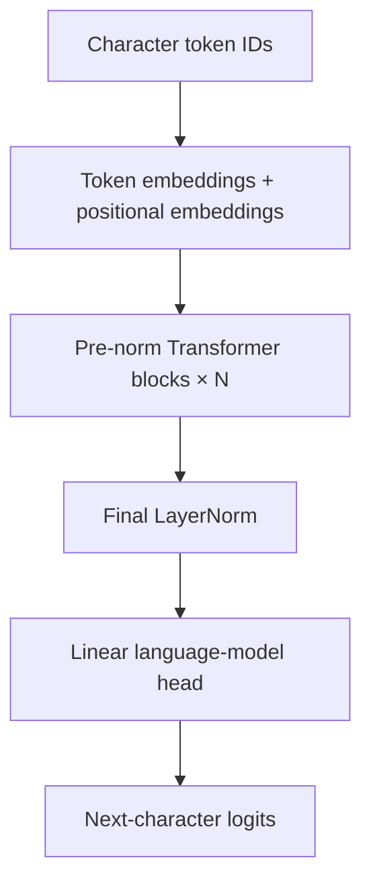
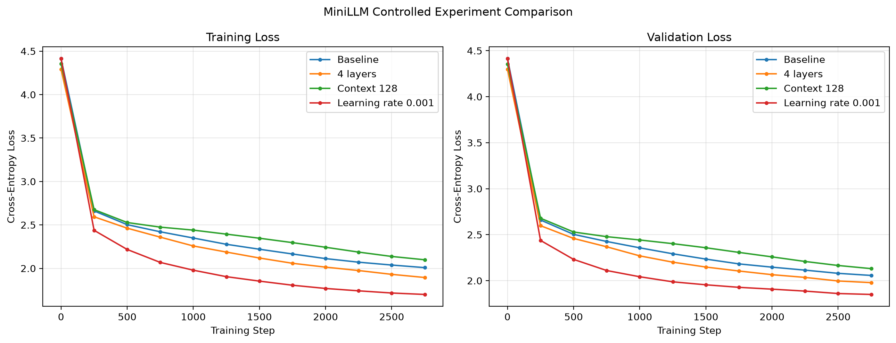

# MiniLLM

MiniLLM is a small decoder-only Transformer language model implemented from
scratch in PyTorch. It is trained at the character level on Tiny Shakespeare
and generates text autoregressively, one character at a time.

The project focuses on implementing and understanding the internal mechanics
of a Transformer rather than wrapping PyTorch's prebuilt Transformer or
multi-head attention modules.

## Features

- Character-level tokenization
- Learned token and positional embeddings
- Manually implemented query, key, and value projections
- Scaled dot-product attention
- Lower-triangular causal masking
- Multi-head causal self-attention
- Pre-layer-normalized Transformer blocks
- Residual connections
- Position-wise feed-forward networks with GELU
- Configurable model depth, width, context length, and dropout
- Training and validation-loss tracking
- Best-validation-loss checkpointing
- CPU, CUDA, and Apple MPS device support
- Autoregressive generation with temperature and top-k sampling
- JSON experiment tracking and loss-curve visualization
- Automated correctness tests

## Architecture



Each Transformer block applies:

1. Layer normalization
2. Multi-head causal self-attention
3. A residual connection
4. A second layer normalization
5. A feed-forward network
6. A second residual connection

Conceptually:

```text
x = x + MultiHeadAttention(LayerNorm(x))
x = x + FeedForward(LayerNorm(x))
```

The feed-forward network expands the embedding dimension by a factor of four,
applies GELU, and projects back to the original embedding dimension.

## Causal self-attention

Each attention head independently projects the input representation into
queries, keys, and values:

```text
Q = XWq
K = XWk
V = XWv
```

Attention is calculated as:

```text
Attention(Q, K, V) = softmax((QKᵀ / √dk) + M)V
```

Here, `dk` is the head dimension and `M` is a causal mask. Entries representing
future positions are replaced with negative infinity before softmax, forcing
their attention probabilities to zero.

This ensures that the prediction at position `t` can only depend on tokens at
positions `0` through `t`.

Multiple attention heads learn separate projections in parallel. Their outputs
are concatenated and passed through a final output projection.

The implementation uses basic PyTorch operations such as `nn.Linear`,
`torch.matmul`, `softmax`, `nn.LayerNorm`, and `nn.Embedding`. It does not use
`nn.Transformer`, `nn.MultiheadAttention`, or a prebuilt attention operation.

## Default configuration

| Setting | Value |
|---|---:|
| Vocabulary size | 65 characters |
| Context length | 64 |
| Embedding dimension | 64 |
| Attention heads | 4 |
| Transformer blocks | 2 |
| Dropout | 0.1 |
| Feed-forward expansion | 4× |
| Trainable parameters | 112,193 |

All architecture and training values can be changed through command-line
arguments.

## Dataset

MiniLLM uses the Tiny Shakespeare corpus distributed with Karpathy's
[`char-rnn`](https://github.com/karpathy/char-rnn) project.

The corpus contains approximately 1.1 million characters. The training script
uses the first 90% for training and the remaining 10% for validation.

The dataset itself is not committed to this repository. Download it by running:

```bash
python scripts/download_data.py
```

This creates:

```text
data/input.txt
```

## Installation

Clone the repository and create a virtual environment:

```bash
git clone https://github.com/RyanPSU/MiniLLM.git
cd MiniLLM

python3 -m venv .venv
source .venv/bin/activate
pip install -r requirements.txt
```

Download Tiny Shakespeare:

```bash
python scripts/download_data.py
```

Run all commands from the repository root.

## Training

Train the baseline model:

```bash
python src/train.py --run-name baseline
```

Train using the best learning rate from the controlled experiments:

```bash
python src/train.py \
    --run-name lr_1e3 \
    --learning-rate 0.001
```

Additional architecture and training settings can be viewed with:

```bash
python src/train.py --help
```

During training, MiniLLM:

- samples random input and next-character target sequences,
- tracks averaged training and validation loss,
- saves a new checkpoint when validation loss improves,
- records the complete run configuration and loss history,
- generates a short sample after training.

Each checkpoint contains:

- model weights,
- optimizer state,
- model configuration,
- training configuration,
- tokenizer vocabulary,
- training step,
- best validation loss.

Checkpoints are saved locally as:

```text
checkpoints/<run-name>_best.pt
```

Experiment metrics are saved as:

```text
results/<run-name>.json
```

## Text generation

Generate text from a trained checkpoint:

```bash
python src/generate.py \
    --checkpoint checkpoints/lr_1e3_best.pt \
    --prompt "ROMEO:" \
    --max-new-tokens 500 \
    --temperature 0.8 \
    --top-k 20 \
    --seed 42
```

Generation is autoregressive. At every step, the model:

1. truncates the context to the configured context length,
2. predicts logits for the next character,
3. adjusts the logits using temperature,
4. optionally restricts sampling to the top-k candidates,
5. samples one character and appends it to the context.

Lower temperatures favor higher-probability characters and generally produce
safer but more repetitive output. Higher temperatures increase diversity but
also increase malformed words and inconsistent structure.

## Controlled experiments

Four controlled experiments were run for 3,000 training iterations with seed
42. Each experiment changed one setting from the baseline.

| Run | Controlled change | Parameters | Best validation loss | Improvement |
|---|---|---:|---:|---:|
| Baseline | Reference configuration | 112,193 | 2.0567 | — |
| 4 layers | Transformer blocks: 2 → 4 | 211,777 | 1.9787 | 3.8% |
| Context 128 | Context length: 64 → 128 | 116,289 | 2.1307 | -3.6% |
| Learning rate 0.001 | Learning rate: 0.0003 → 0.001 | 112,193 | **1.8502** | **10.0%** |



### Findings

Increasing depth improved validation loss but nearly doubled the model's
parameter count and substantially increased runtime.

Increasing the context length to 128 did not improve validation loss within the
fixed 3,000-step training budget and was the slowest tested configuration. This
does not establish that longer context is generally harmful; it only shows that
the additional context did not pay off under this experiment's constraints.

Increasing the learning rate from `0.0003` to `0.001` produced the best tested
validation loss without increasing model size or runtime. It was therefore
selected for the generation-setting experiments.

Full configurations, metrics, parameter counts, and histories are available in
the [`results`](results/) directory.

## Generation experiments

Text generation was compared using the best tested checkpoint while holding
the prompt, random seed, and output length constant.

| Temperature | Top-k | Observed behavior |
|---:|---:|---|
| 0.5 | 20 | Conservative but repetitive |
| 0.8 | 20 | Best balance of structure and variety |
| 1.2 | 20 | More diverse but substantially less coherent |
| 0.8 | None | More unlikely characters and malformed phrases |

The model learns speaker labels, line breaks, punctuation patterns, and
Shakespeare-like word structure. Because of its small size and character-level
training objective, it does not produce consistently meaningful prose.

The complete generated samples are available in
[`results/generation`](results/generation/).

## Testing

Install the development dependencies:

```bash
pip install -r requirements-dev.txt
```

Run the test suite:

```bash
python -m unittest discover -s tests -v
```

The 17 tests verify:

- tokenizer encode/decode round trips,
- unknown-character handling,
- model output dimensions,
- requested attention-head and layer counts,
- architecture-configuration validation,
- causal masking,
- dependence on earlier context,
- forward and backward passes,
- finite gradients,
- generation length,
- generation-argument validation,
- checkpoint and tokenizer restoration.

The causal-mask test compares sequences with identical prefixes and different
future tokens. It verifies that changing future tokens does not affect logits
at earlier positions.

## Repository structure

```text
MiniLLM/
├── data/
│   └── README.md
├── results/
│   ├── generation/
│   ├── experiment_summary.md
│   ├── loss_comparison.png
│   └── experiment JSON files
├── scripts/
│   ├── download_data.py
│   └── plot_results.py
├── src/
│   ├── generate.py
│   ├── model.py
│   ├── tokenizer.py
│   └── train.py
├── tests/
│   ├── test_checkpoint.py
│   ├── test_model.py
│   └── test_tokenizer.py
├── requirements.txt
└── requirements-dev.txt
```

## Limitations

- Character-level tokenization is less efficient than subword tokenization.
- The tested models are intentionally small and trained for only 3,000 steps.
- Generation recomputes the available context instead of using a key-value
  cache.
- Learned positional embeddings impose a fixed maximum context length.
- Experiments used a single dataset and one random seed per configuration.
- The model learns surface-level Shakespeare structure but limited long-range
  semantic coherence.

These limitations make MiniLLM an educational implementation rather than a
production-scale language model.

## References

- Vaswani et al.,
  [Attention Is All You Need](https://arxiv.org/abs/1706.03762)
- Karpathy,
  [char-rnn and Tiny Shakespeare](https://github.com/karpathy/char-rnn)